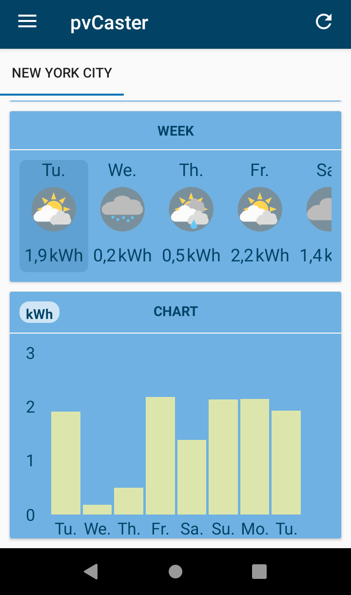
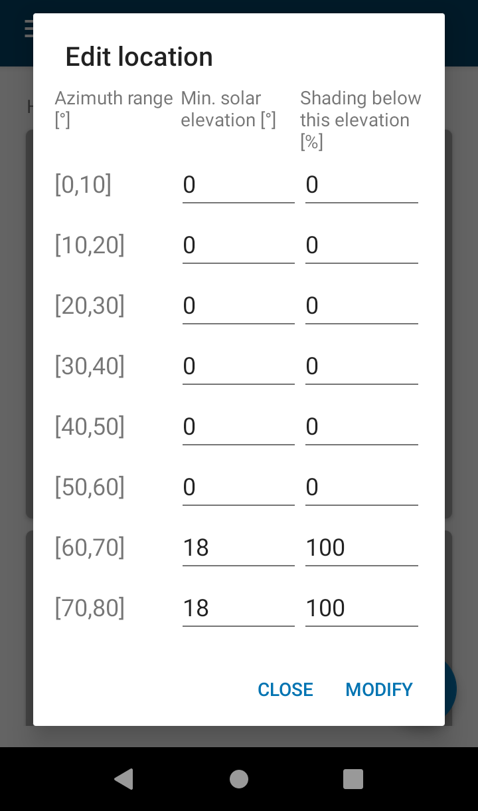

<pre>Send a coffee to woheller69@t-online.de 
</pre>

| **RadarWeather** | **Gas Prices** | **Smart Eggtimer** |
|:---:|:---:|:---:|
| |  |  |
| **Bubble** | **hEARtest** | **GPS Cockpit** |
|  |  |  |
| **Audio Analyzer** | **LavSeeker** | **TimeLapseCam** |
|  | |  |
| **Arity** | **omWeather** | **solXpect** |
|  |  |  |
| **gptAssist** |  |  |
|  |  |  |

# solXpect

solXpect is an app that forecasts the output of your solar power plant by using direct and diffuse radiation data from Open-Meteo.com, calculating the position of the sun, and projecting the radiation on your solar panel. 
It shows the estimated energy production for the next 16 days, with hourly values calculated for the preceding hour. As an example, if there are 150 Wh shown at 11:00 this means you can expect 150 Wh between 10:00 and 11:00 from your photovoltaic system.
The values starting with Σ show the cumulated energy since midnight of the first day.
To use solXpect, you simply enter your latitude and longitude coordinates, as well as the azimuth and tilt of your solar panel. 
You also enter information about the peak power, efficiency, temperature coefficient, and area of your solar panel, as well as the maximum power and efficiency of your inverter.
Additionally, solXpect allows you to define shading on your solar panels by specifying the minimum elevation of the sun necessary for the sun to hit the solar panels, as well as the percentage of shading for elevations below this value.
If you have multiple solar panels with the same latitude and longitude but pointing in different directions, you can define them as separate locations and use the 'show sum' feature to summarize their output.
Overall, solXpect is a powerful tool for optimizing the use of your own energy and reduce your energy costs. 

    

## Parameters

#### Name
Define a name for the location.
If you have several modules pointing in different directions at the same location you can activate "showSum" mode in settings.
In this case you should define your location names as 'myPV | part1', 'myPV | part2', etc. In 'show sum' mode the location is then shown as 'myPV' and '|' is taken as delimiter.

#### Latitude [°] 
Enter the north-south position of your solar power plant, ranging from -90° at the south pole to 90° at the north pole.

#### Longitude [°]
Enter the east-west position of your solar power plant, with 0° defined as the prime meridian. Positive longitudes are east of the prime meridian, negative ones are west.

#### Azimuth [°]
Specify the horizontal direction of your solar power plant, with 0° corresponding to North, 90° to East, 180° to South, and 270° to West.

#### Tilt [°]
Specify the vertical direction of your solar power plant, with 0° pointing upwards towards the sky and 90° being a vertical orientation pointing towards the horizon.

#### Cells peak power [W]
Enter the maximum power your solar cells (total of all cells) can deliver. At the moment this value is only used if a value of 0 is specified for cells efficiency or cell area.
In this case it is assumed that the cells peak power is given at an irradiance of 1000W/sqm.

#### Cells efficiency  [%]
Specify the portion of energy in the form of sunlight that can be converted into electricity by the solar cell.

#### Temperature coefficient  [%/K]
Enter the dependence of the cell power on temperature, usually in the range of -0.4%/K. Cell temperature is estimated from ambient temperature and total irradiance.

#### Cell area [m2]
Enter the size of your solar panels (total of all cells).

#### Diffuse radiation efficiency  [%]
Specify the efficiency of your solar power plant for diffuse radiation. When pointing up, it should be around 100%, but when pointing towards the horizon, it may be 50% or less, depending on the environment.
You probably need to optimize this parameter.

#### Albedo  [0..1]
Specify the average albedo for your environment to take reflections into account. The value ranges from 0 (all radiation is absorbed) to 1 (all radiation is reflected).
Examples: Fresh snow: 0.8, green gras: 0.25, asphalt: 0.1
You probably need to optimize this parameter.

#### Inverter power  [W]
Specify the maximum power of your inverter. If it is lower than the maximum power of your panels, the output power of your system will be limited by this parameter.

#### Inverter efficiency  [%] 
Enter the efficiency of your inverter.

#### Shading
In this section you can define the shading on your solar panels.
For each azimuth angle range, you can specify the minimum elevation of the sun that is necessary for the sun to hit the solar panels.
For elevations below this value you can set the percentage of shading. For example, a building will reduce radiation by 100%, a tree maybe only by 60%.
You can use the sun icon button in the main window to get information about the current azimuth and elevation of the sun to determine at what elevation the sun gets above buildings or trees.

## License

This app is licensed under the GPLv3.

The app uses:
- Parts from Privacy Friendly Weather (https://github.com/SecUSo/privacy-friendly-weather) which is licensed under the GPLv3
- The weather data service is provided by [Open-Meteo](https://open-meteo.com/), under <a href='http://creativecommons.org/licenses/by/4.0/'>Attribution 4.0 International (CC BY 4.0)</a>
- Icons from [Google Material Design Icons](https://material.io/resources/icons/) licensed under <a href='http://www.apache.org/licenses/LICENSE-2.0'>Apache License Version 2.0</a>
- Material Components for Android (https://github.com/material-components/material-components-android) which is licensed under <a href='https://github.com/material-components/material-components-android/blob/master/LICENSE'>Apache License Version 2.0</a>
- Leaflet which is licensed under the very permissive <a href='https://github.com/Leaflet/Leaflet/blob/master/FAQ.md'>2-clause BSD License</a>
- WilliamChart (com.db.chart) (https://github.com/diogobernardino/williamchart) which is licensed under <a href='http://www.apache.org/licenses/LICENSE-2.0'>Apache License Version 2.0</a>
- Android Volley (com.android.volley) (https://github.com/google/volley) which is licensed under <a href='https://github.com/google/volley/blob/master/LICENSE'>Apache License Version 2.0</a>
- AndroidX libraries (https://github.com/androidx/androidx) which is licensed under <a href='https://github.com/androidx/androidx/blob/androidx-main/LICENSE.txt'>Apache License Version 2.0</a>
- AutoSuggestTextViewAPICall (https://github.com/Truiton/AutoSuggestTextViewAPICall) which is licensed under <a href='https://github.com/Truiton/AutoSuggestTextViewAPICall/blob/master/LICENSE'>Apache License Version 2.0</a>
- Map data from OpenStreetMap, licensed under the Open Data Commons Open Database License (ODbL) by the OpenStreetMap Foundation (OSMF) (https://www.openstreetmap.org/copyright)
- Solar positioning library (https://github.com/klausbrunner/solarpositioning) which is licensed under <a href='https://github.com/klausbrunner/solarpositioning/blob/master/LICENSE.txt'>MIT License</a>
- Zip4j (https://github.com/srikanth-lingala/zip4j) which is licensed under Apache License Version 2.0
- CompassView (https://github.com/kix2902/CompassView) which is published under Apache License 2.0

## Contributing

If you find a bug, please open an issue in the Github repository, assuming one does not already exist.
  - Clearly describe the issue including steps to reproduce when it is a bug. In some cases screenshots can be supportive.
  - Make sure you mention the Android version and the device you have used when you encountered the issue.
  - Make your description as precise as possible.

If you know the solution to a bug please report it in the corresponding issue and if possible modify the code and create a pull request.
